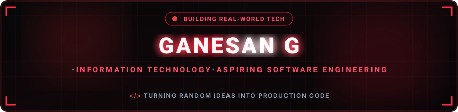

  

  

 

Software Engineering Enthusiast | Java | Frontend Developer

Passionate about designing scalable software and intuitive user experiences.
Focused on mastering Data Structures & Algorithms while building modern web applications.
Always learning, always improving, always shipping.

---

## 🌐 Connect with Me

---

## 💻 I CODE IN
      
 

---

## 🚀IDE and Tools I Use

        

---

## 📚 Currently Learning

- Java
- Data Structures & Algorithms
- Operating system
- Object-Oriented Programming
- SQL
- System Design Fundamentals

---

## 📊 GitHub Stats

 
 

## 🧩 LeetCode Stats

---

## 📈 GitHub Activity Graph

---

### 💡 Quote

 "தெய்வத்தான் ஆகா தெனினும் முயற்சிதன் மெய்வருத்தக் கூலி தரும்" 

 

<!-- Proudly created with GPRM ( https://gprm.itsvg.in ) -->
                                                         

